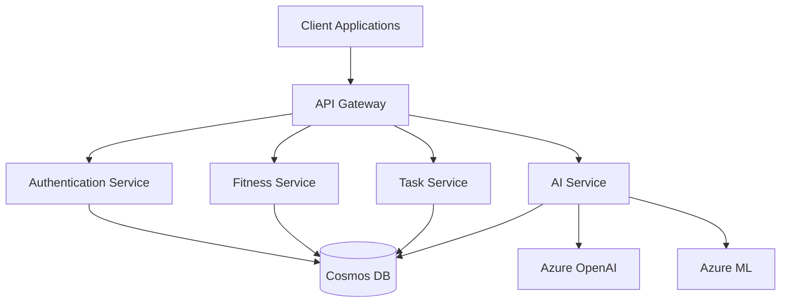
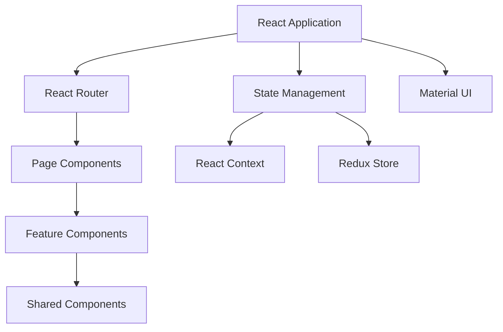
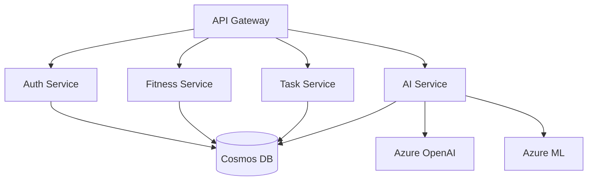
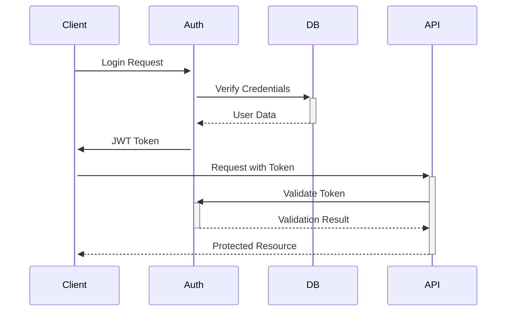
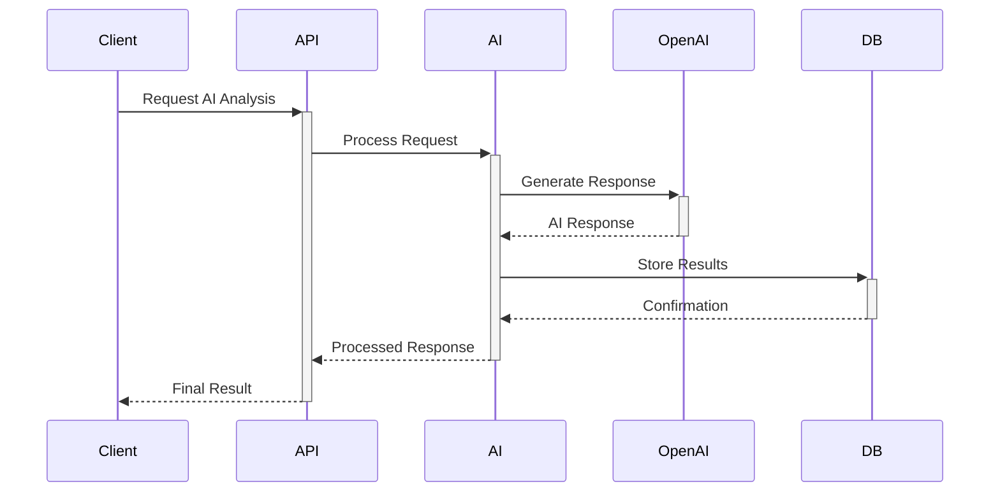
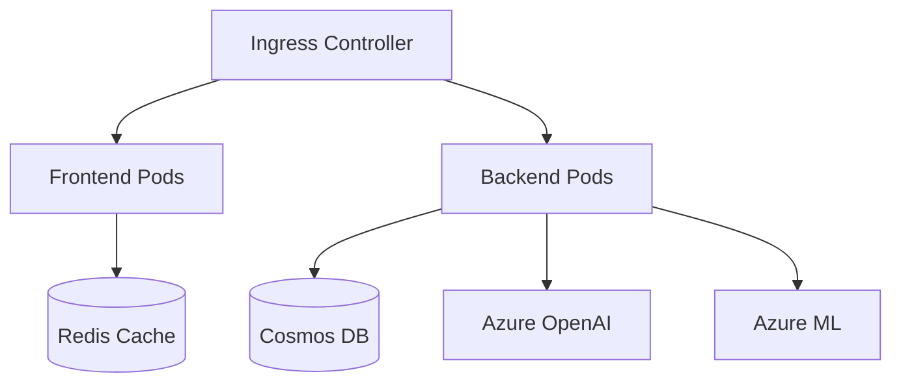
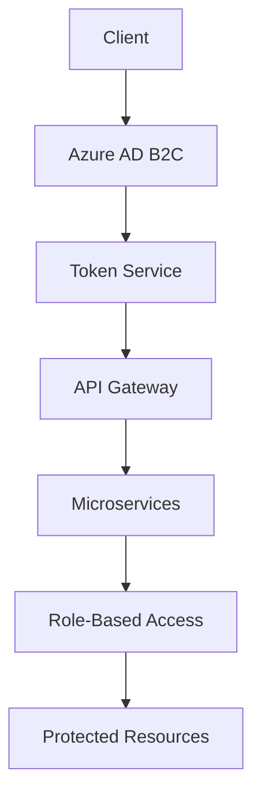

# Perfect LifeTracker Pro - Architecture Design

## System Architecture Overview

## Component Architecture

### Frontend Architecture

### Backend Architecture

## Data Flow

### Authentication Flow

### AI Service Flow

## Deployment Architecture

### Kubernetes Deployment

## Security Architecture

### Authentication & Authorization

## Version History
| Date | Version | Changes | Author |
|------|---------|---------|--------|
| YYYY-MM-DD | 1.0.0 | Initial version | [Author] | 