# Perfect LifeTracker Pro - Architecture Design

## System Architecture Overview

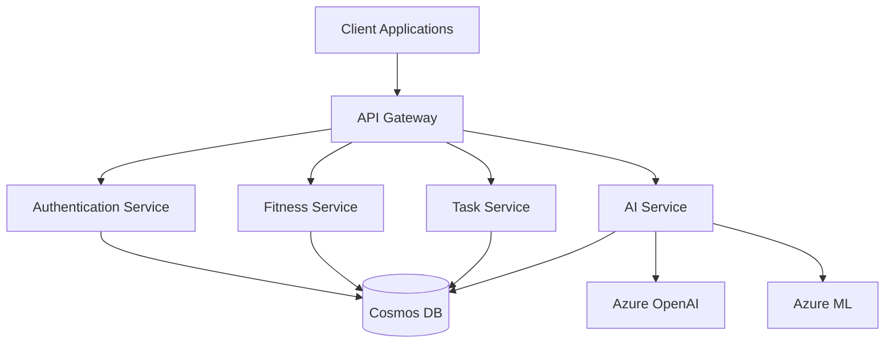

## Component Architecture

### Frontend Architecture
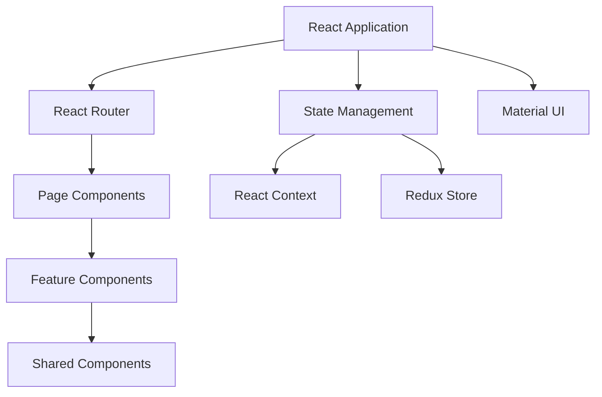

### Backend Architecture
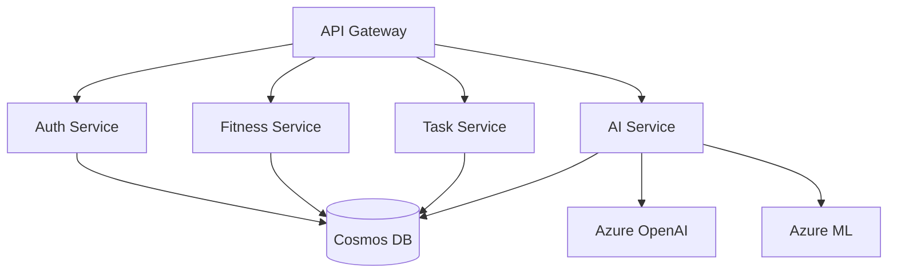

## Data Flow

### Authentication Flow
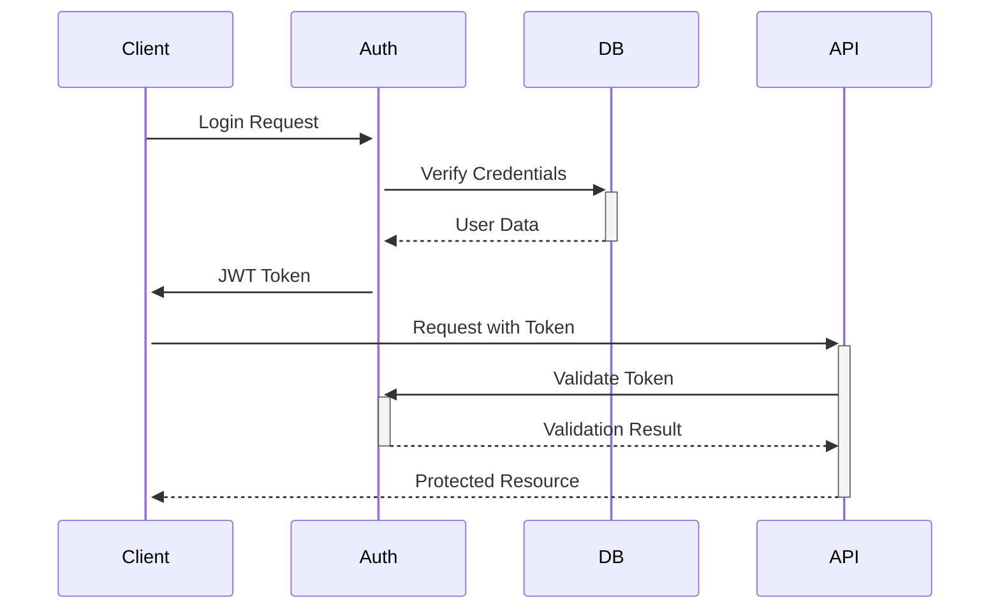

### AI Service Flow
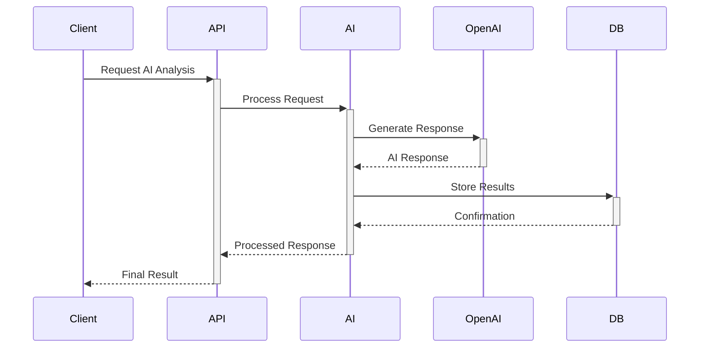

## Deployment Architecture

### Kubernetes Deployment
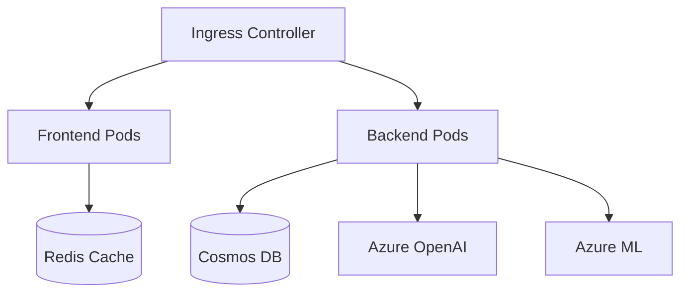

### Docker Development Environment
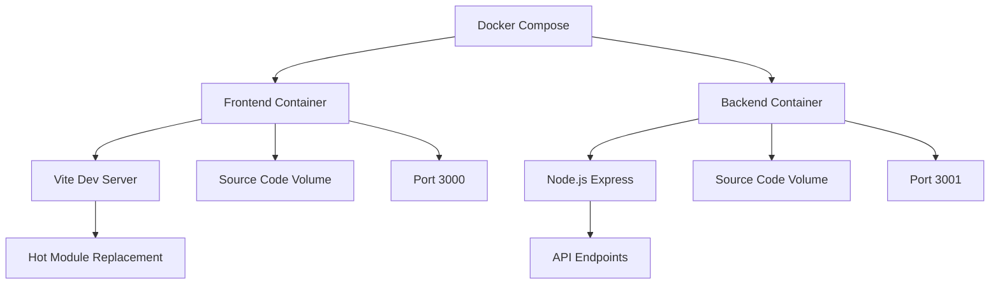

## Security Architecture

### Authentication & Authorization
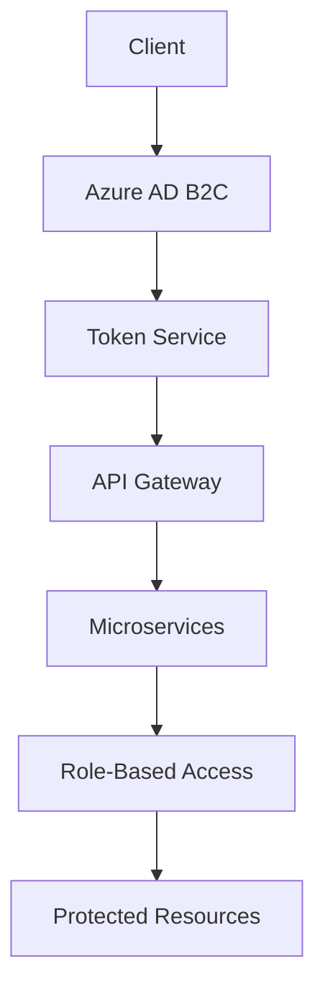

## Current Implementation Status

### Frontend Implementation
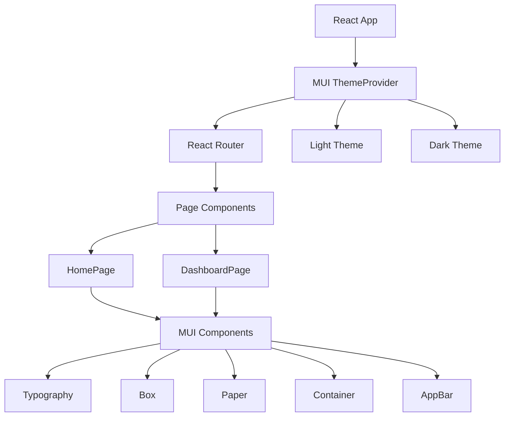

### Current Component Structure
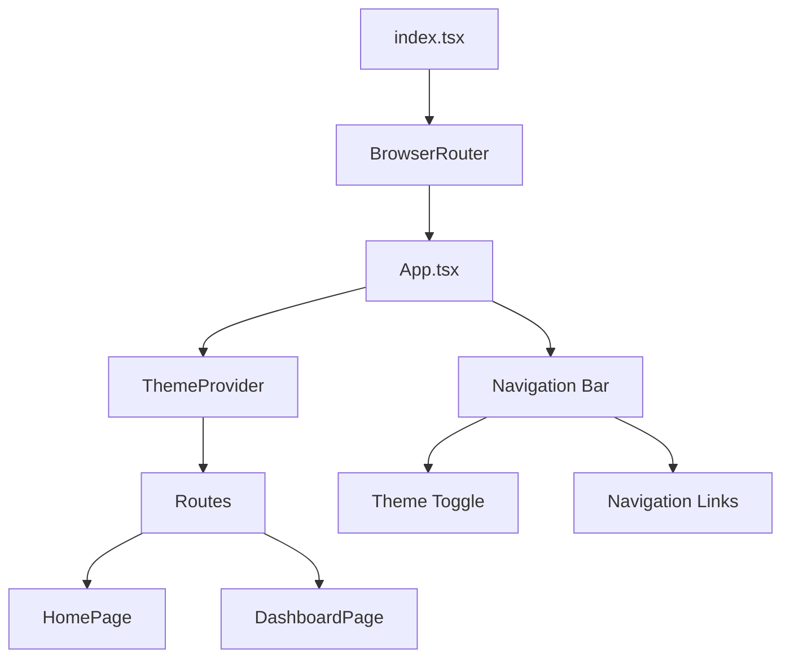

### Theme Implementation
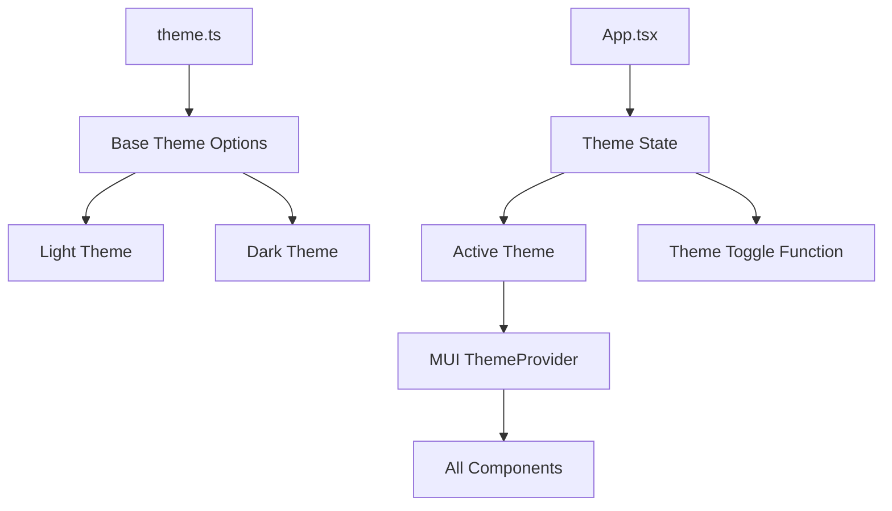

### Development Workflow
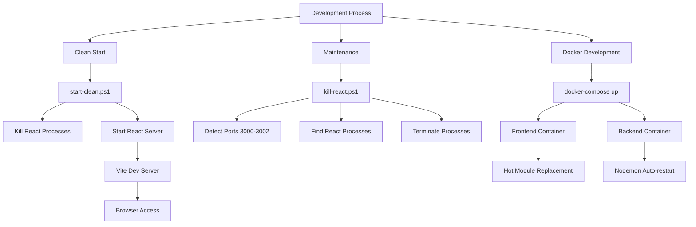

### Build Systems
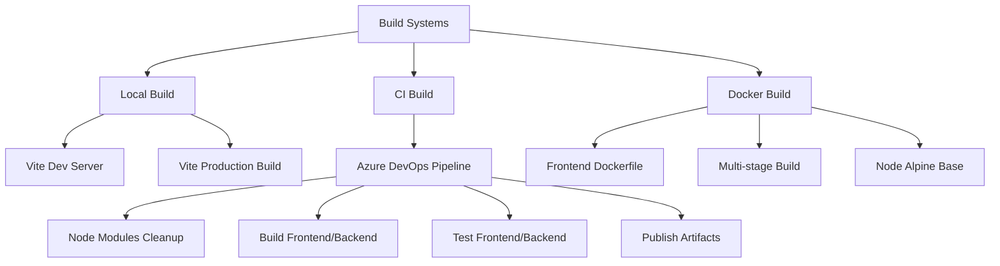

## Version History
| Date | Version | Changes | Author |
|------|---------|---------|--------|
| 2024-04-08 | 1.0.0 | Initial architecture design | Perfect LifeTracker Pro Team | 
| 2024-04-08 | 1.1.0 | Added frontend implementation details | Perfect LifeTracker Pro Team | 
| 2024-04-08 | 1.2.0 | Added development workflow with PowerShell scripts | Perfect LifeTracker Pro Team | 
| 2024-04-09 | 1.3.0 | Added Docker development environment and Vite build system | Perfect LifeTracker Pro Team |